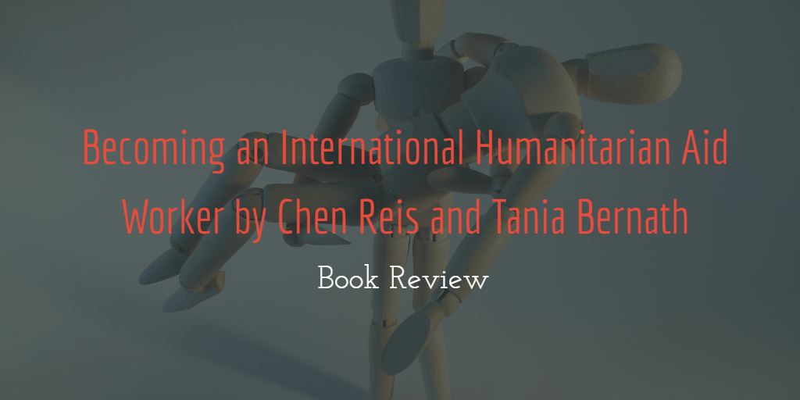

The increased complexity of humanity's contemporary challenges has put more significant strain on our humanitarian relief endeavour. An international collaborative humanitarian act is pivotal to alleviate the calamities of affected societies. This demand is accompanied by the emerging new methodologies in recruiting a competent workforce to reach a high level of effective engagement in the relief process. After admirable research, Chen Reis and Tania Bernath, in their page-turner book "Becoming an International Humanitarian Aid Worker," present valuable information in an attempt to give the reader a holistic, yet targeted, view of this domain. Their focus is on straightforwardly communicating well-synthesized data to the reader. 

The book's nine reasonably-sequenced chapters gradually develop the reader's insight into this field. The authors demonstrate an excellent effort in highlighting controversial topics, which, according to them, have been undermined by other literature on the topic. The ideas of rising awareness before and after taking a position in aid organizations are well constructed, connected, and delivered throughout the book. After going through the concepts and advice, each chapter has an exercise section that helps the reader to form a coherent answer to whether they want to commence a humanitarian career journey or not. There is a recognizable input in presenting the book as a consistent unit with an impressive flow of ideas, linking all chapters together and constructing a comprehensive understanding. However, the Third Sector's definition and interpretations of the best methods to deliver the organization's mission differs from one perspective to another. Along with the author's approach of being realistic and objective, there is an implicit indication that this sector tends to be more business-like. This indication lacks information on preserving what makes its values and impact on societies distinct from other sectors. Therefore, to some extent, there is a redundant emphasis on being practical in approaching the aid career as it is a position in a for-profit sector.

The book's descriptions of the career's factual trends, changes, and challenges would form a reliable foundation of knowledge for those considering embarking on humanitarian aid positions. With its collective input, it would also help those who are already in the field and want to get insights on the new trends in the sector or restructure their human resources management practices. 

The authors demonstrate a sufficient credibility level in their data collection method. They efficiently perform their research by gathering information from different sources, which is essential to minimise the probability of structuring the book based on biased views. They include interviews and surveys from practitioners of different ages and work experience. Utilising the online job offers requirements and specifications is an innovative approach in analysing the organizations' demands and expectations of the workers. This leaves no room to doubt in analysing the potential for success that future candidates should possess.

Furthermore, the book's contribution to addressing the scarcity of realistic advice for international aid career is indeed vital and helpful, as the authors write at length about issues that are rarely mentioned in the aid agencies' media. Recruiting an uninformed international aid workforce would do more harm than good to the workers, their organizations, and the affected community. The book sufficiently informs the reader by addressing the root of these issues from different perspectives. It follows an admirable gradual approach in presenting the issues through the chapters, leading to thoughtful advice and tips to avoid such challenges in different stages of such a career. Taking a humanitarian aid position is a life-changing decision; therefore, it is essential to expose the reader to the whole picture of the work environment. For instance, the book can give a better understanding of the career's security threats and how each organization has its security protocols that would characterise their working conditions and patterns. Another valuable contribution of the book is its analysis of sexual harassment, where it is not uncommon nowadays to hear about sexual harassment cases that took place long ago. This could be attributed to an organization's negligence in making and enforcing strict regulations to treat this problem, in which the victims' fear of hurting their career or suffering a social stigma could be a factor. Another critical discussion could be found in the field experience in areas such as living arrangements, living conditions, and practically, elaborating on the lack of a structured career path. This is, indeed, a critical quality to consider and value in international humanitarian aid careers. Mentioning these issues from this dimension could prompt the readers to revisit and evaluate pre-made assumptions that would affect their adaptation to new career situations and potentially adversely affect their mental health. After openly defining these problems first in chapter three, the authors provide a comprehensive set of optional solutions to avoid problems and deal with such situations in the final chapter. The authors also make useful suggestions regarding the type of questions to be asked before accepting the job offer.

By reading the book, readers can gain valuable, detailed insight into assessing their strengths and weaknesses. Readers are encouraged to be pragmatic in developing the necessary skills and experience for each type of job in the aid sector. For instance, it is indeed more efficient to get good field experience ahead of starting a master's degree, making the learning curve more fulfilling and beneficial. The writers also acknowledge the advancement of the workplace and the new market demands; therefore, their recommended skills and experience for the job are quite relevant. This advancement, undoubtedly, also has established new channels of communication. Accordingly, the authors' recommendations for seeking unconventional networking strategies, such as LinkedIn, are reasonable.

Additionally, arbitrarily applying for jobs without proper tracking of already submitted applications could be overwhelming at its best and could lead to opportunities loss at its worse. Readers are encouraged to be persistent and organized, as finding a dream job could be challenging and time-consuming. Setting a clear plan is also pivotal to achieving one's goal. After equipping their readers with the overall character of the sector and how to prepare for the job, the authors make it clear that it is crucial to make fair use of the know-how they developed in seeking the job. They offer hands-on tips on how job seekers could position themselves advantageously in the sector's current competitive environment. In fact, they impressively show how to manage this process, starting from writing a resume to choosing the right job offer wisely.

Nonetheless, from the broad spectrum of the contributions to this research and the book title itself, one would expect a balanced overview of the career from different perspectives. The book is meant to address the question of how to get a job in an international aid organization. Urging the readers to isolate their emotional engagement from the perspective of professionalism has positive and negative aspects. Moreover, the authors provide an unequal discussion of career challenges, rewards, and social impact. Dedicating the majority of the book to bombard the reader with complications of this career field without adequately promoting its positive impact on societies could be overwhelming and discouraging for readers considering joining the aid field, whether on a professional or a volunteer basis.

The book should not have touched on this aspect ambiguously. Further explanation of their definition of "the best possible choice" is necessary. It should not have been left open without adequate discussion as any misinterpretation of this concept could subconsciously lead ill-informed readers to adopt rather than challenge unethical practices. It might lead them to assume that it is tolerable to compromise their standards in order to protect their career progression. Also, in the context of international aid careers, the authors might have taken it too far in encouraging the readers to hide their unprofessional behaviour by cleaning up or even deactivating their social media accounts to gain their potential employers' acceptance. Hiding identity to increase the chances of employment is considered a kind of deception. This could be considered an encouragement to employees with a questioned background, which contradicts the organization's rules and regulations to cover-up their past to secure jobs as international aid workers.

Thus, the book has immense potential in presenting abstract advice on becoming an international humanitarian aid worker. It delivers consistent concepts in simple language throughout a coherent nine chapters. Its inclusive data gathering approach targets a wide range of readers who might find it interesting as an introductory guide to entering this sector. However, the authors should have made it clear that the professionalism movement should be incorporated into the sector's essential values. It is not arguable that the third sector inevitably has to cope with the need for a specialised workforce and that there is a growing expectation of professionalisation. Nonetheless, there should be also more significant emphasis on what makes the professional movement in this sector different from other sectors. Readers should be aware that they should not approach this field in a way that only aligns with their principles; instead, it should align with the sector's core principles. After all, there is no perfect guide for such a life-changing decision. Also, it is not applicable to form the holistic picture from merely reading this book, as reading it should be complementary to the overall understanding of what it means to become an international humanitarian aid worker.
