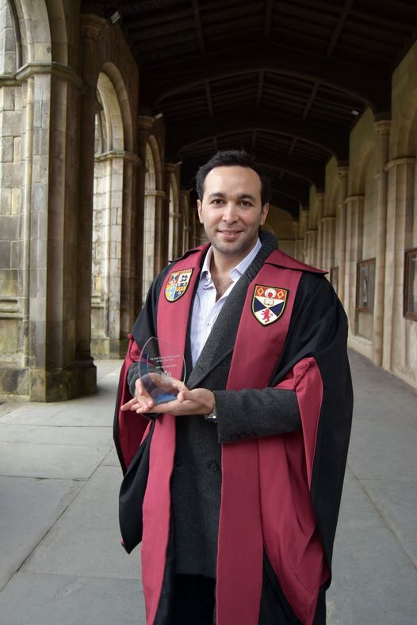

Many people, even close ones, ask me why are you wasting your time on a PhD and bother yourself with non-profits, why don’t you get a “real job”? 

I guess the real question that we should be asking is why most media platforms idealise starting for-profit endeavours, and feed kids with the dream of being the next Mark Zuckerberg or Bill Gates? I am not saying we should hate money and we all turn hippies, on the contrary, money is important. But, why don’t we promote building enterprises with social missions in their hearts that offer highly competitive job opportunities with decent wages? Enterprises that maximize social impact for people instead of achieving staggering financial gains for those shareholders drinking Piña colada in the Bahamas. 

These questions among many others have led me to start a journey in 2016. I even changed my FB cover to an image with the caption “Wait for it” : 3 Fast forward to 2021, together with a great pool of talented people in different domains, we launched Global Share. This lifetime experience has given me a second family, but that's another story for another time. Together we envision a world where technology is a portal for removing career or academic barriers. Our mission is to employ technology for supporting communities through providing knowledge and fair opportunities. 

My passion for open knowledge has led me to start a PhD on a research topic that aligns with Global Share’s vision, and from there I have reached more than one magical milestone in 2021. During the last year, I was:

- Privileged to co-supervise three MSc projects about open knowledge.
- Appointed as the Postgraduate Development Officer at the Student Union
- Co-founded the IDEA Network at the University of St Andrews 

And finally,  I have been jointly received the Up-and-Coming Wikimedian award of 2021 from Wikimedia UK, which I am holding in the picture. I couldn't be more proud of myself.

Receiving this award is an honour and an affirmation that I am on the right track. I am truly grateful to Wikipedia UK (Specifically Sara Thomas ^^) and to all those who’ve helped me reach this milestone in my career, as I embark on more related tasks that contribute to open knowledge.

I believe that by following my passion, I am working on the noblest cause that I can be involved in. This post will be the first of many to talk more about what I do for a living, hopefully inspire others to pursue what they feel right and passionate about in this life, and gain new friends of course!

――――――――――――――――――――――――――――――――――――

