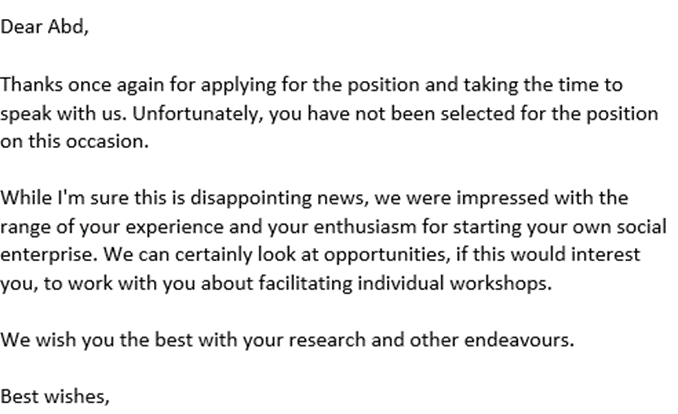
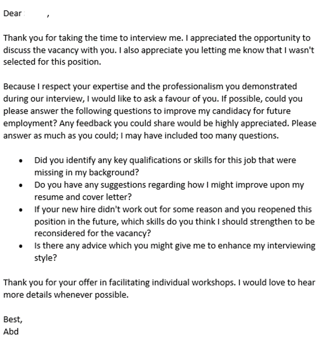
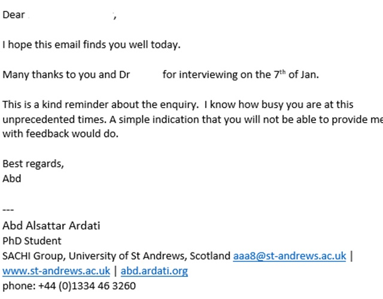
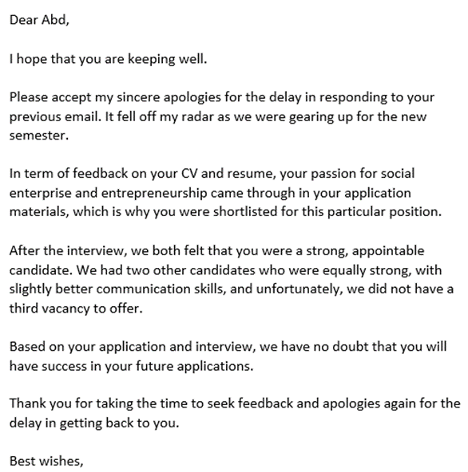
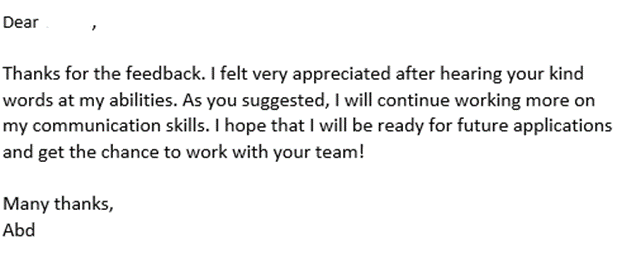

My job applications have often produced rejection emails. Below is the story of a recent one that has taught me a lot!

Having volunteered for various roles at the university, I believed, I have developed the required skills for a part-time Entrepreneurial Events Officer position. “Easy” echoed in my mind, as I was so confident I’d get the position, I didn’t even prepare for the interview!

The attached five screenshots below document my correspondence after getting the kind rejection letter. “How could I be rejected?” The job was tailored to my skills and professional journey. The interviewees’ explanation was that the successful candidates had slightly better communication skills.

  
  
  
  
  

I don’t share my experience to spread negative vibes. On the contrary, I am sharing with you the lessons I’ve learned from many rejections with pieces of advice that might be useful to some of you.

- **Beware of Overconfidence:** poor preparation and preparedness could kill your chances. Be mindful of the rabbit and turtle fable and prepare well for the interview. Improve your interview skills and cover all the possible questions.

- **Be Resilient:** Speedy recovery from failure is one of the top job skills employers look for, in 2021. In the background section, I posted a great Forbes article on resilience, during our unprecedented times, by Khurram Masood. Seek an Explanation: no is hardly the good answer you need! It should be a “yes,” or a “no” with a “why.” If possible, you should know precisely the reason for the employer’s rejection. In the comments section, I included the article from which I borrowed the content shown in the images.

- **Embrace It:** I appreciate the kind words from friends telling me they had already identified the employees they needed, even before advertising for the position. This could be true for them, but in my case, I have to say, I have a long way to go to master my English communication skills, which would be a game-changer.

- **Be Grateful for the Experience:** consider the job rejection a sort of a free consultation, helping you improve your job application skills, propelling you forward.

- **Take Action:** Invest faith, love, and hard work in planning your next step. Find out the best way to enhance your skills quickly! It might be a course you take, or private lessons or practising with a friend. Just avoid shelving it into your wishlist of things you’d never get done.
Best wishes for success in all of your future endeavours!

## Background

<a href="https://www.forbes.com/sites/khurrammasood/2021/01/01/2021-will-demand-even-more-resilience-at-work-heres-how-to-build-it/">2021 Will Demand Even More Resilience At Work. Here’s How To Build It</a>

<a href="https://www.zippia.com/advice/how-to-ask-why-you-didnt-get-the-job-in-5-easy-steps/">How to Ask Why You Didn’t Get The Job In 4 Easy Steps</a>

――――――――――――――――――――――――――――――――――――
