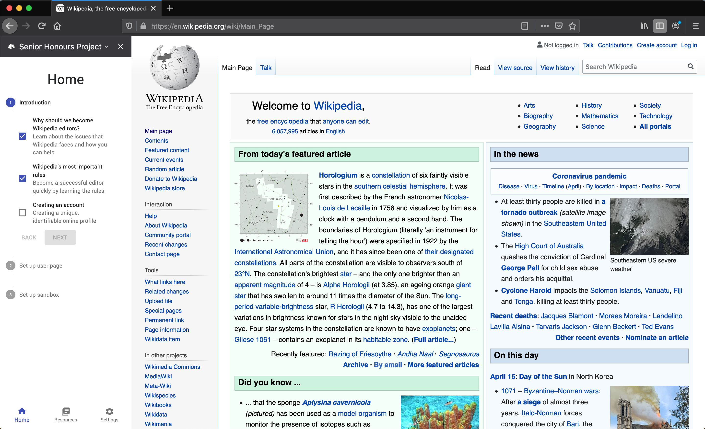

  
  
  
  

#Description

Wikipedia has suffered from a decline in new active editors since 2007, and attempts at successfully onboarding new editors to become active contributors have yet to make a considerable impact. Creating an onboarding experience to increase new editor numbers and diversification is becoming a more important issue to tackle as Wikipedia's popularity grows with active contribution declining. 

This project by Jack Leslie and suppervised by Alexander Voss & Abd Alsattar Ardati assesses previous onboarding project attempts and presents a prototype for a new onboarding experience to tackle the pitfalls of its predecessors. Our proposed solution is a browser extension with a direct and interactive onboarding experience to facilitate the transition of new editors to continuous, active editors.

#Objectives

- Develop a browser extension to guide a user in completing tasks that new editors of
Wikipedia typically need to accomplish.
- Provide a curated set of links and information in the browser extension as a reference for
the user provided in a context-sensitive manner to provide guidance as the user goes
about a task spanning multiple Wikipedia pages.
- Provide functionality in the browser extension to highlight important page content
required for the accomplishment of the tasks through DOM manipulation.
- Provide functionality to perform tasks through mouse interaction with highlighted page
elements.

