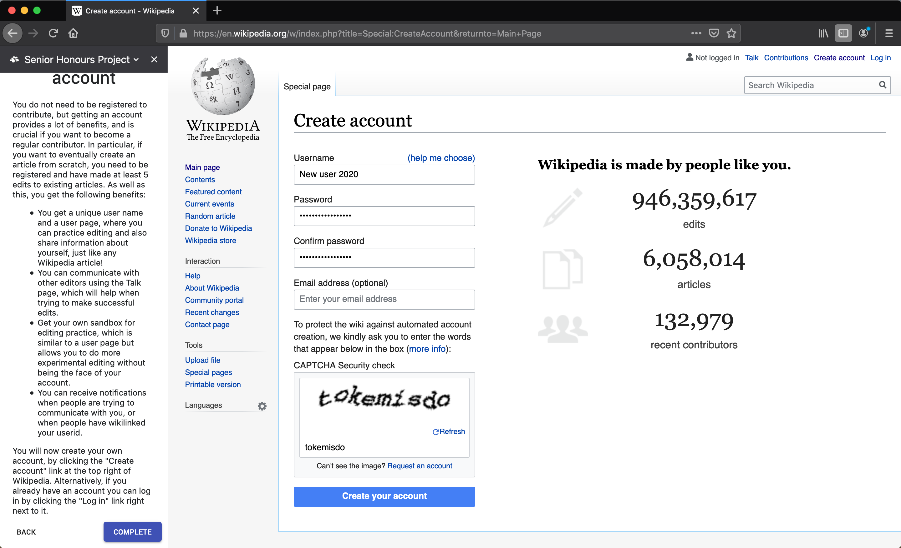
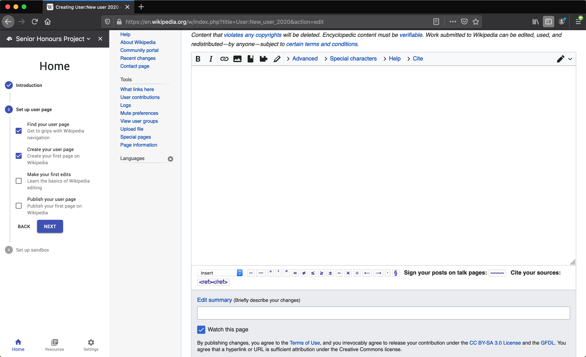
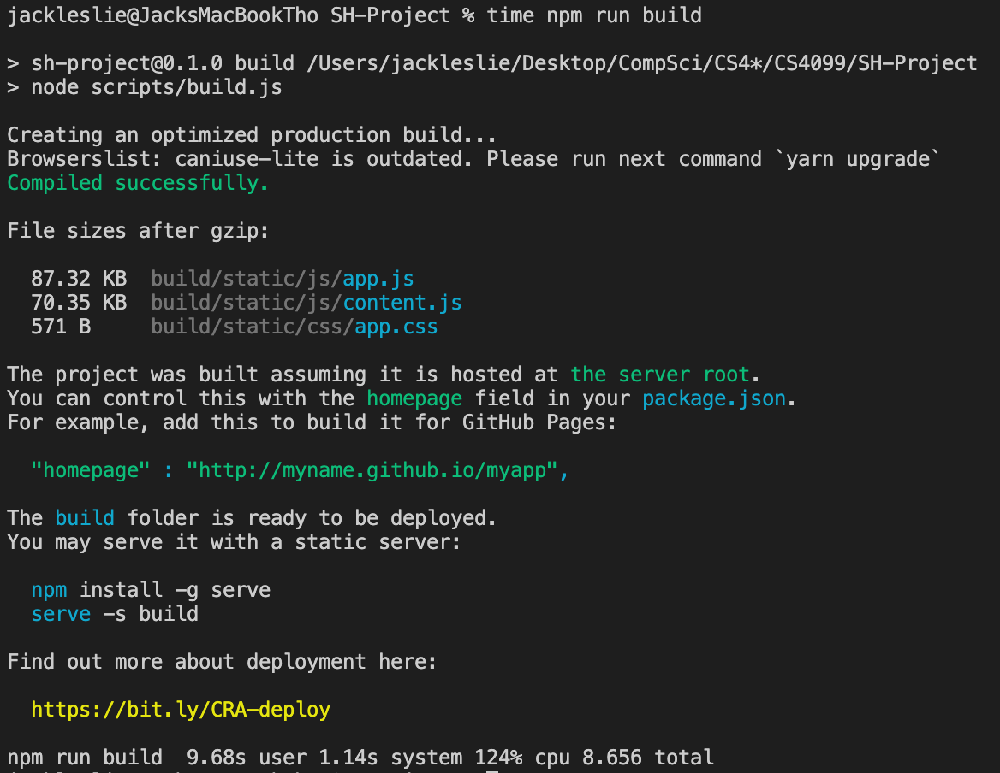

  
  
  
  

## Description

Wikipedia has suffered from a decline in new active editors since 2007, and attempts at successfully onboarding new editors to become active contributors have yet to make a considerable impact. Creating an onboarding experience to increase new editor numbers and diversification is becoming a more important issue to tackle as Wikipedia's popularity grows with active contribution declining. 

This project by Jack Leslie and suppervised by Alexander Voss & Abd Alsattar Ardati assesses previous onboarding project attempts and presents a prototype for a new onboarding experience to tackle the pitfalls of its predecessors. Our proposed solution is a browser extension with a direct and interactive onboarding experience to facilitate the transition of new editors to continuous, active editors.

## Supervisors
Dr Alexander Voss, Abd Alsattar Ardati

## Artefact(s)

- Develop a browser extension to guide a user in completing tasks that new editors of
Wikipedia typically need to accomplish.
- Provide a curated set of links and information in the browser extension as a reference for
the user provided in a context-sensitive manner to provide guidance as the user goes
about a task spanning multiple Wikipedia pages.
- Provide functionality in the browser extension to highlight important page content
required for the accomplishment of the tasks through DOM manipulation.
- Provide functionality to perform tasks through mouse interaction with highlighted page
elements.

## Conclusions

Before implementing a new onboarding experience for Wikipedia we had to discuss what previous onboarding attempts had done well and what their limitations were. From this discussion we were able to derive an exciting new idea for onboarding which involved using a sidebar extension as a way to deliver content and incorporating the key aspects for successful onboarding. These key aspects included a focus on being introduced early in the editor lifecycle with a clear overview of the onboarding process itself and a way to access specific information with ease during onboarding. The persistence of the extension in the current browser context for the user, rather than being in a separate window or tab, provided an even more direct and effective experience for users. The project was built using sound design principles and with industry standard libraries, frameworks and tooling in the JavaScript ecosystem. Through scenario testing and heuristic evaluation the extension shows great promise as an effective new onboarding experience, however would benefit greatly from real user feedback in order to measure the effectiveness. The focus on software quality with respect to high reusability, as well as self documentation with tools such as Storybook, mean that the project could easily be picked up and iterated on to benefit from in response to real user feedback, which could be gathered in a more suitable climate.

## Background

Jonathan T. Morgan and Aaron Halfaker. “Evaluating the impact of theWikipedia Teahouse on newcomer socialization and retention”. In:Proceedings  of  the  14th  International  Symposium  on  Open  Collaboration  -OpenSym ’18(2018).

Jonathan T. Morgan et al. “Tea and sympathy”. In:Proceedings  of  the 2013  conference  on  Computer  supported  cooperative  work  -  CSCW  ’13(2013).

Tamara  Rasamny.  “Mind  the  Gap:  Highlighting  Women’s  Representa-tion  on  Wikipedia”.  In:Democracy  Works(June  8,  2017). 

Sneha Narayan et al. “The Wikipedia Adventure”. In:Proceedings of the 2017 ACM Conference on Computer Supported Cooperative Work and So-cial Computing - CSCW ’17(2017).

――――――――――――――――――――――――――――――――――――
