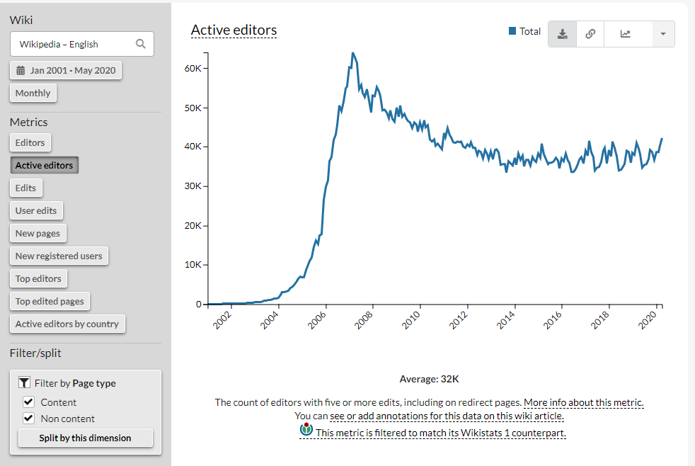

## Description

Wikipedia arguably is “one of the largest collaborative projects in history”. At the same time, as the diagram below shows, the English version of Wikipedia has suffered a significant loss of contributors between 2007 and 2012 and numbers have been fluctuating since then. Researchers like Halfaker et al. (2013) have attributed this decline to many reasons, such as the increased complexity of community guidelines that govern the editing of Wikipedia.

  

Existing research shows that individualistic editing is one of the main characteristics of Wikipedia’s contribution model (Jemielniak and Raburski 2014). This collaboration model is praised for building the Wikipedia as we know it. However, it is also known for a poor volunteer retention rate.

The reason may well be that not everyone interested in editing Wikipedia will want to follow this model. Some people may want to ‘dip in’ and occasionally edit as they find the time. Others might want to be engaged in a community and contribute through more sustained interactions with other people.

To find out more about this, we might ask whether people on-boarded via Wikipedia editing events are more likely to take the second route, whether people change their behaviour over time and what else we can learn about editing patterns. Do participants collaborate with people who they met at the event? Are there differences in the outputs from people working in communities?

The aim of this project is to use data on Wikipedia editing events in combination with Wikipedia data dumps containing information about edits to answer questions like the ones above

## Supervisors
Dr Alexander Voss, Abd Alsattar Ardati

## Artefact(s)

- A quantitative analysis that would involve writing code to extract a subset of data from a Wikipedia data dump followed by the construction of a reproducible analysis.

- This could take the form of a Jupyter notebook, for example. This requires familiarity with a suitable programming environment such as Python or R as well as basic quantitative data analysis skills. It might therefore suit someone enrolled in the data-intensive analysis MSc.

- Someone with a background in visualisation might develop an interactive based on the data rather than a statistical analysis.

## Background

Halfaker, Aaron, R. Stuart Geiger, Jonathan T. Morgan, and John Riedl. 2013. “The Rise and Decline of an Open Collaboration System: How Wikipedia’s Reaction to Popularity Is Causing Its Decline.” The American Behavioral Scientist 57 (5): 664–88.

Jemielniak, Dariusz, and Tomasz Raburski. 2014. “Liquid Collaboration?” In , Kociatkiewicz and Kostera (eds.) Liquid Organization. Routledge 2014. pp.85–103.

Li, Ang, and Rosta Farzan. 2018. “Keeping up on Current Events! A Case Study of Newcomers to Wikipedia,” 348–69.

Liu, Jun, and Sudha Ram. 2011. “Who Does What: Collaboration Patterns in the Wikipedia and Their Impact on Article Quality.” ACM Trans. Manage. Inf. Syst., 11, 2 (2): 1–23.

Sepehri Rad, Hoda, Aibek Makazhanov, Davood Rafiei, and Denilson Barbosa. 2012. “Leveraging Editor Collaboration Patterns in Wikipedia.” In Proceedings of the 23rd ACM Conference on Hypertext and Social Media, 13–22. HT ’12. New York, NY, USA: Association for Computing Machinery.

Sydow, Marcin, Katarzyna Baraniak, and Paweł Teisseyre. 2017. “Diversity of Editors and Teams versus Quality of Cooperative Work: Experiments on Wikipedia.” Journal of Intelligent Information Systems 48 (3): 601–32.

Wierzbicki, Adam, Piotr Turek, and Radoslaw Nielek. 2010. “Learning about Team Collaboration from Wikipedia Edit History.” In Proceedings of the 6th International Symposium on Wikis and Open Collaboration, 1–2. WikiSym ’10 27. New York, NY, USA: Association for Computing Machinery.

Zha, Yilong, Tao Zhou, and Changsong Zhou. 2016. “Unfolding Large-Scale Online Collaborative Human Dynamics.” Proceedings of the National Academy of Sciences of the United States of America 113 (51): 14627–32.

――――――――――――――――――――――――――――――――――――
